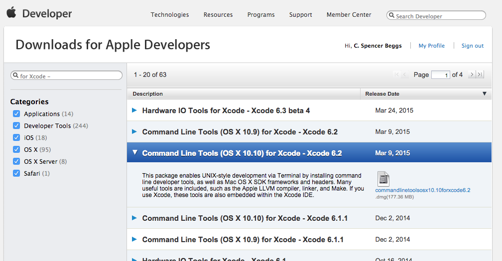
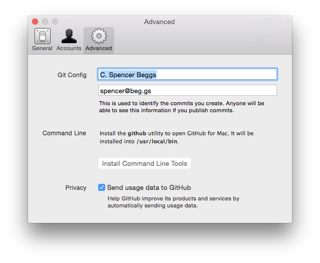
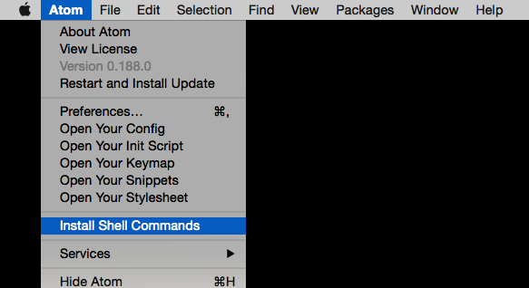
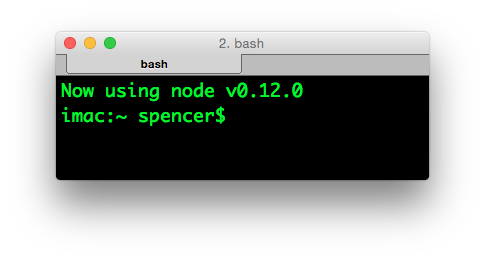

# Setup for OS X

Macs are great for developing Node.JS. OS X even comes with Node installed by default, but we are going to do a little extra work to make life a little easier during class.

All you need to be able to follow along during the lessons is a working installation of Node. If you can't complete one of the steps below (except installing Node itself), you should be able to run most of the example code.

## Update OS X

Before class you should update you version of OS X to the latest you can. [OS X 10.10 Yosemite](https://itunes.apple.com/us/app/os-x-yosemite/id915041082?mt=12) is available for free in the App Store.

If you already have Yosemite installed or are not updating to Yosemite, you should open the Mac App Store on your computer and update download any updates to your operating system version that Apple as made available.

## Install Xcode

One of the powerful features of Node.JS is that can use native C++ extentions. To be able to compile C++ code we are going to need some development tools.

[Xcode](https://itunes.apple.com/us/app/xcode/id497799835?mt=12) is Apple's free intergrated development evniornemnt (IDE). It is also available from the App Store and will install most of the tools we need.

Once you have installed Xcode, open the program and accept the license agreement.

Finally, you will need to install [Xcode's Command Line Tools](https://developer.apple.com/downloads/index.action?name=for%20Xcode%20-) from Apple's Developer Center. You will need to select the correct package from the list. Be sure to match your OS version and your Xcode version.



To test if you have Xcode and installed run the following command:

```
which make && which gcc
```

It should return:

```
/usr/bin/make
/usr/bin/gcc
```
## Install Git

Check to make sure you have Git available:

```
which git
```

should return:

```
/usr/bin/git
```

If you don't have Git installed, the easiest way to install or update git on a Mac is to download and install the [GitHub for Mac](https://mac.github.com/) GUI client.

After you have installed it, open the program and go to **Preferences > Advanced** and then click on "Install Command Line Tools":



We will use Git to access code examples. The demo code repository is hosted on GitHub. If you don't have an account yet, [sign up for one](https://github.com/join).

## Install Atom

[Atom](https://atom.io/) is a free text editor designed by GitHub. Although, you can use any text editor to follow along on with the examples, I recommend you download and install Atom. I am going to configure a couple plugins to help us debug our code.

After you have installed Atom, open the program, then open it's program drop-down menu and select "Install Shell Commands":



After the shell commands have installed, we can add a few useful plugins to Atom. Open a new Terminal window and run:

```
apm install atom-beautify atom-handlebars jshint react
```

## Install NVM

The [Node Version Manager](https://github.com/creationix/nvm) allows us to install and quickly switch between different versions of Node. In a new Terminal:

```
curl -o- https://raw.githubusercontent.com/creationix/nvm/v0.26.1/install.sh | bash
```

Next you need to enable NVM:

```
source ~/.nvm/nvm.sh
```

Download the latest version of Node:

```
nvm install 4
```

Tell new shells to use nvm and Node 0.12 on start up:

```
echo -e '\n#Config for Intro to Node.JS\nsource ~/.nvm/nvm.sh\nnvm use 4\nexport NODE_ENV=development' >> ~/.bash_profile
```

If you have setup your system correctly, when you open a new Terminal window your should see the message, "Now using node v4.0.0 (npm v2.14.2)".



## Install RoboMongo

[RoboMongo](http://robomongo.org/) is a cross-platform GUI client for MongoDB. It will help you see what you are doing in the database section.

## Expose hidden files

```
defaults write com.apple.finder AppleShowAllFiles YES.
```
